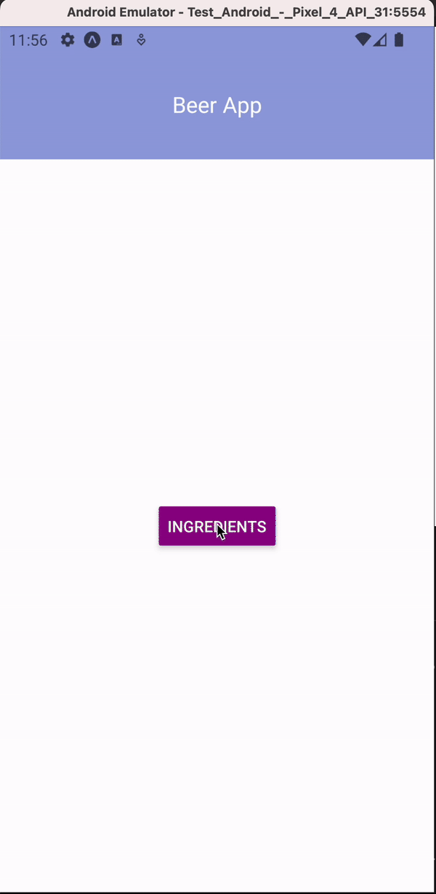

# Beer App
### Alumno: José Manuel Berretta Moreno
### Curso: Desarrollo de Aplicaciones 

## Wireframes
[Figma Wireframes](https://www.figma.com/file/NzffqgRbW0iw54JCgsPjTb/Untitled?node-id=0%3A1&t=VPpH9mIHKoukUxJc-1)

## Avance Actual
### Clase 7
Consigna: A partir de este ciclo de estilos y elementos, integra a tu proyecto un poco más de comportamiento lógico y visual:
- Renderizado condicional entre elementos (switch entre pantallas)
- Constantes compartidas.
- Fonts externos.

